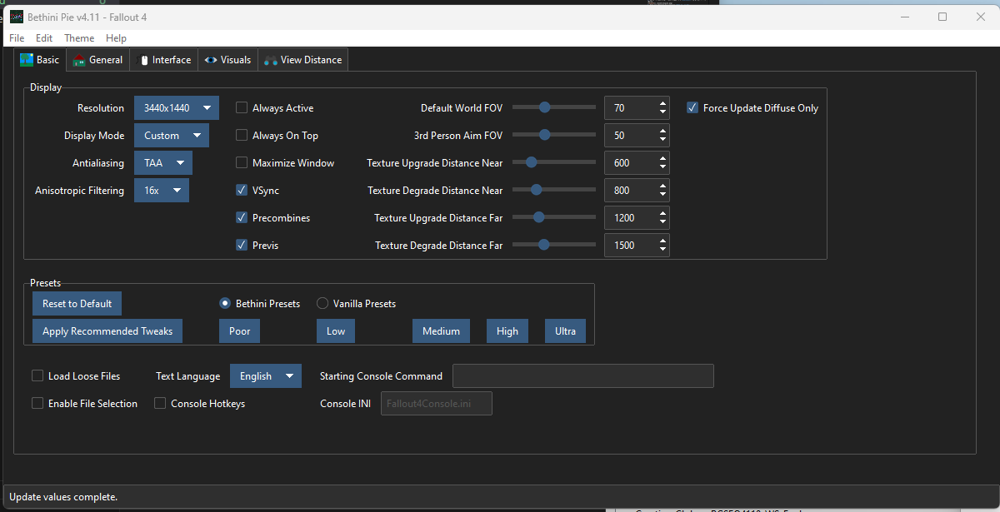
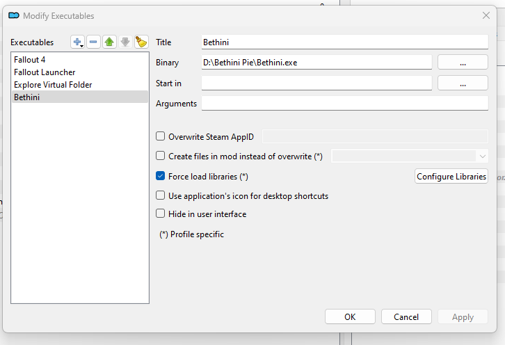
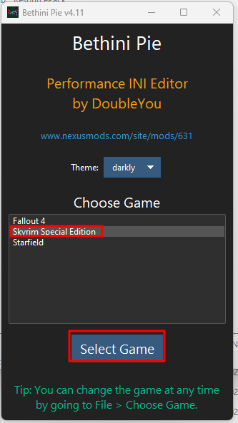

# BethINI Pie

Кроме Mod Organizer 2, нам также понадобится **BethINI Pie**.
Данная программа позволит выбирать оптимизированные пресеты и более конкретные опции через простой в использовании интерфейс.

## Установка

1. Скачайте [BethINI Pie](https://www.nexusmods.com/site/mods/631).
2. Извлеките архив.
3. В MO2 нажмите на выпадающий список на правой панели рядом с кнопкой **Выполнить**.
4. Нажмите на **Редактировать**, затем нажмите на **+** в левом верхнем углу и **Добавить из файла**.

5. Выберите **BethINI Pie**, который вы распаковали.
6. Затем сохраните настройки и запустите **BethINI** выбрав его в этом списке.

 

7. Выберите *Fallout 4* и нажмите **Выбрать игру**.
8. Затем выберите INI профиль, чтобы он указывал на профиль внутри MO2, а не в директории документы.
