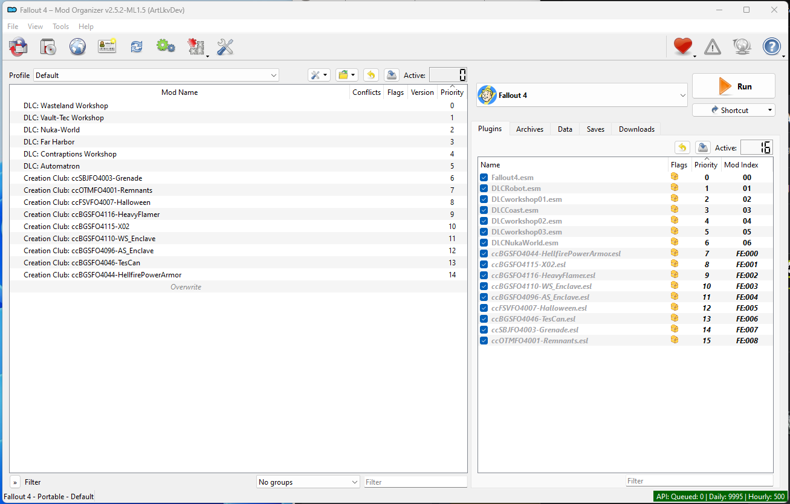

# Mod Organizer 2

**MO2** - это менеджер игровых модов с открытым исходным кодом, в основном используемые для Bethesda.

У него есть ряд особенностей:

- **Виртуальная файловая система**: MO2 не устанавливает моды в папку игры, а скорее создает виртуальную файловую систему, из которой игра читает данные.
- **Система профелей**: MO2 позволяет создавать несколько профилей с различными настройками модов, сохранениями и настройками.
- **Двухпанельный интерфейс**: MO2 разделен на две стороны, левая - список модов, правая - список плагинов. Это позволяет легко разрешать конфликты и управлять модами.
- **Портативность**: Благодаря использованию USVFS, MO2 имеет "портативные" режим, которые позволяет переместить всю папку MO2 в другое место/устройства с минимальными настройками.

## Почему MO2?

MO2 был выбран для данного руководство из-за его **простоты использования** и способности сохранять **папку игры в чистоте**.
Это важно, потому что это позволяет легко разрешать конфликты и управлять модами, а также делает исправление ошибок тривиальным.

По сравнению с **Vortex**, MO2 не скрывает от пользователя самые важные части моддинга, что облегчает понимание того, что происходит и почему, хотя и ценой потенциального непонимания ситуации по началу у неопытных пользователей.

В первую очередь MO2 - инструмент для работы, он и не должен быть идеальным. Он такой, какой есть.

## Установка

1. Загрузите [Mod Organizer 2](https://www.nexusmods.com/site/mods/874).
2. Запустите установщик и завершите установку.
3. Запустите Mod Organizer 2.

## Настройка

1. На странице создания экземпляра выберите **Создать переносимый экземпляр** и нажмите кнопку *Далее*.
2. Выберите **Fallout 4** и нажмите *Далее*.
3. Когда вас спросят о настройках профиля, **включите все параметры** и нажмите *Далее*
4. Путь для сохранения файлов оставьте **по-умолчанию**.
5. Подключите **Nexus**.