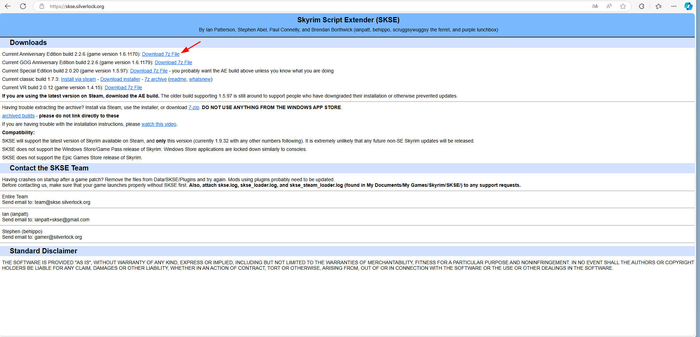

# Модификация движка

Самый первый шаг, который надо сделать - модифицировать движок для совместимости со всем разнообразием модов.

## Моды

1. [SKSE](https://skse.silverlock.org/)

 

Данная утилита расширяет движок позволяя писать скрипты, модифицируя ими содержимое игры.

Данную утилиту надо распаковать в корень игры.

После чего добавляем данную утилиту в запускаемые через MO2 программы.

2. [DLL Plugin Loader](https://www.nexusmods.com/skyrimspecialedition/mods/10546)

Переименуйте файл в корневой папке из "bink2w64.dll" в "binkw64_.dll".
А затем извлеките туда файл из архива и изменить его имя на "bink2w64.dll".

Позволяет загружать в игру внешние DLL файлы(лишь загружать, не использовать).

3. [Address Library for SKSE](https://www.nexusmods.com/skyrimspecialedition/mods/32444)

Позволяет использовать внешние DLL файлы(заголовочные файлы, базы данных).

Подключается через MO2.

4. Ниже приведены два плагина для поддержки DLSS в Skyrim.

- [Upscaler Base Plugin](https://www.nexusmods.com/site/mods/502)
- [Skyrim Upscaler](https://www.nexusmods.com/skyrimspecialedition/mods/80343)

Upscaler Base Plugin установите вручную в каталог игры. Также не забудьте скачать нужные драйвера для видеокарты с поддержкой DLSS.

5. Тут у нас ряд модификаций, которые нужны для общей цели - расширение поддержки скриптов.

- [PapyrusUtil](https://www.nexusmods.com/skyrimspecialedition/mods/13048) - сам скриптовый движок.
- [Papyrus Extender](https://www.nexusmods.com/skyrimspecialedition/mods/22854) - Добавление нового функционала для PapyrusUtil.
- [Papyrus Tweaks](https://www.nexusmods.com/skyrimspecialedition/mods/77779) - Исправление для PapyrusUtil.
- [Paper](https://www.nexusmods.com/skyrimspecialedition/mods/73849) - Еще парочку новых функций к PapyrusUtil.
- [JContainers](https://www.nexusmods.com/skyrimspecialedition/mods/16495) - Добавляет поддержку JSON структур.
- [FileAccess Interface for Skyrim SE Scripts - FISSES](https://www.nexusmods.com/skyrimspecialedition/mods/13956) - Позволяет через интерфейс редактировать внутриигровые параметры, нужно для MCM меню.

Для FileAccess Interface качайте версию для Skyrim SE, а не AE.

Все три мода ставятся через MO2.

6. Тут приведены модификации для улучшения работы внутриигровой консоли.

- [ConsoleUtilSSE NG](https://www.nexusmods.com/skyrimspecialedition/mods/76649) - улучшенная консоль.
- [Console Commands Extender](https://www.nexusmods.com/skyrimspecialedition/mods/28210) - расширение функционала консоль, добавление новых комманд.
- [More Informative Console](https://www.nexusmods.com/skyrimspecialedition/mods/19250) - теперь консоль выводит больше информации если навестить на объект.

Все три мода ставятся через MO2.

7. Парочка фиксов для движка.

- [Scaleform Translation Plus Plus NG](https://www.nexusmods.com/skyrimspecialedition/mods/77359) - Позволяет вставить запасной перевод из SkyUI, а также резервные варианты английского языка. Если по какой-то причине нужный текст не был обработан.
- [Better Jumping](https://www.nexusmods.com/skyrimspecialedition/mods/18967) - Позволяет прыгать во время спринта.
- [Fuz Ro D-oh](https://www.nexusmods.com/skyrimspecialedition/mods/15109) - Добавляет в игру поддержку не озвученных диалогов.
- [Instantly Skip Dialogue NG](https://www.nexusmods.com/skyrimspecialedition/mods/89163) - Позволяет нормально скипать диалоги, без лагов и задержек у NPC.

Все моды ставятся через MO2.

8. Расширения движка для манипулирования объектами.

- [Base Object Swapper](https://www.nexusmods.com/skyrimspecialedition/mods/60805) - Позволяет через конфиги заменять объекты и ссылки.
- [Keyword Item Distributor](https://www.nexusmods.com/skyrimspecialedition/mods/55728) - Позволяет задать ключевые слова для оружий, эффектов и прочих предметов.
- [Custom Skills Framework](https://www.nexusmods.com/skyrimspecialedition/mods/41780) - Позволяет использовать кастомные скиллы и деревья перков.
- [Spell Perk Item Distributor](https://www.nexusmods.com/skyrimspecialedition/mods/36869) - Позволяет любым NPC в игре добавить заклинания, перки, предметы, крики и прочее.
- [FormList Manipulator](https://www.nexusmods.com/skyrimspecialedition/mods/74037) - Позволяет добавлять формы в FormList.
- [Container Item Distributor](https://www.nexusmods.com/skyrimspecialedition/mods/99486) - добавляет/убирает предметы и уровневые списки в/из контейнеров.
- [Object Categorization Framework](https://www.nexusmods.com/skyrimspecialedition/mods/81469) - позволяет распределять предметы по категориям.

Все моды ставятся через MO2.

9. Расширения движка для работы с клавиатурой.

- [Dynamic Key Action Framework NG](https://www.nexusmods.com/skyrimspecialedition/mods/87706) - Позволяет создавать привязку клавиш для анимаций или действий.
- [dTry's Key Utils](https://www.nexusmods.com/skyrimspecialedition/mods/69944) - Дополняет первый плагин. 
- [Auto Input Switch](https://www.nexusmods.com/skyrimspecialedition/mods/54309) - Автоматически меняет управление между мышью и джойстиком.

для dTry's выбирайте SE, а не AE версию.